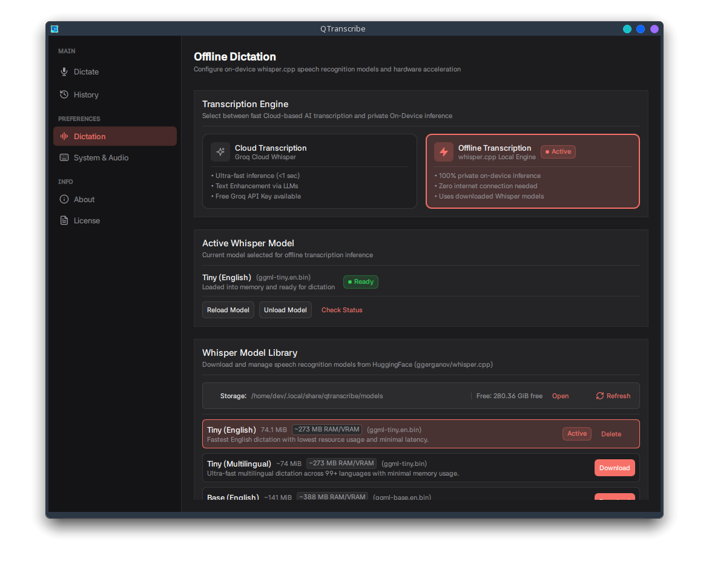
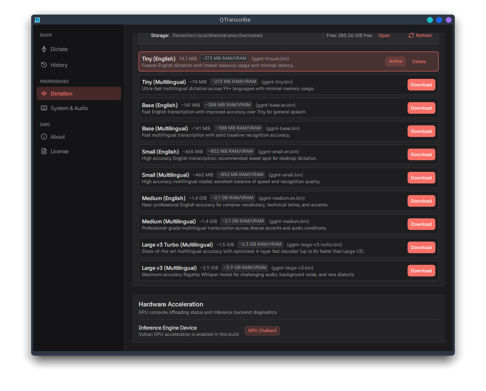
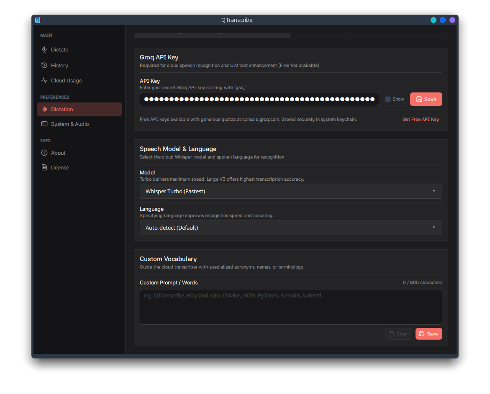
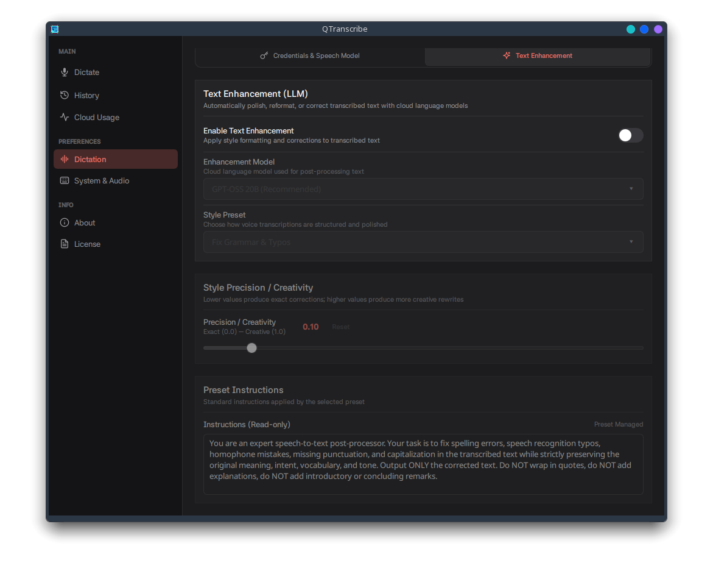
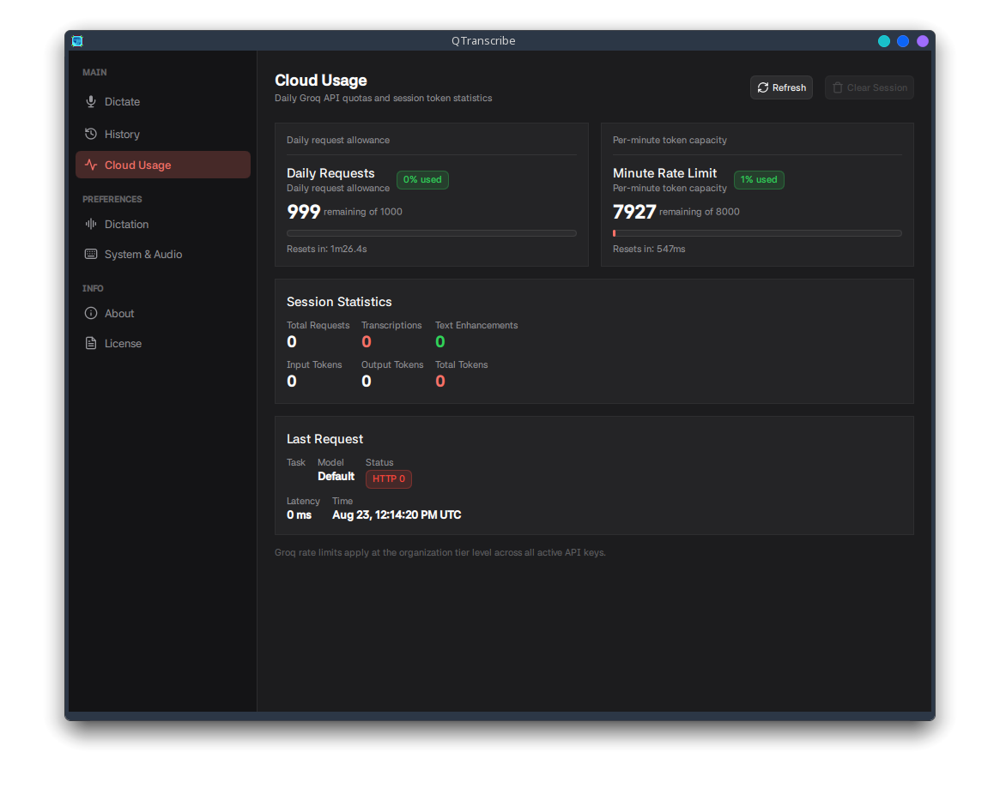
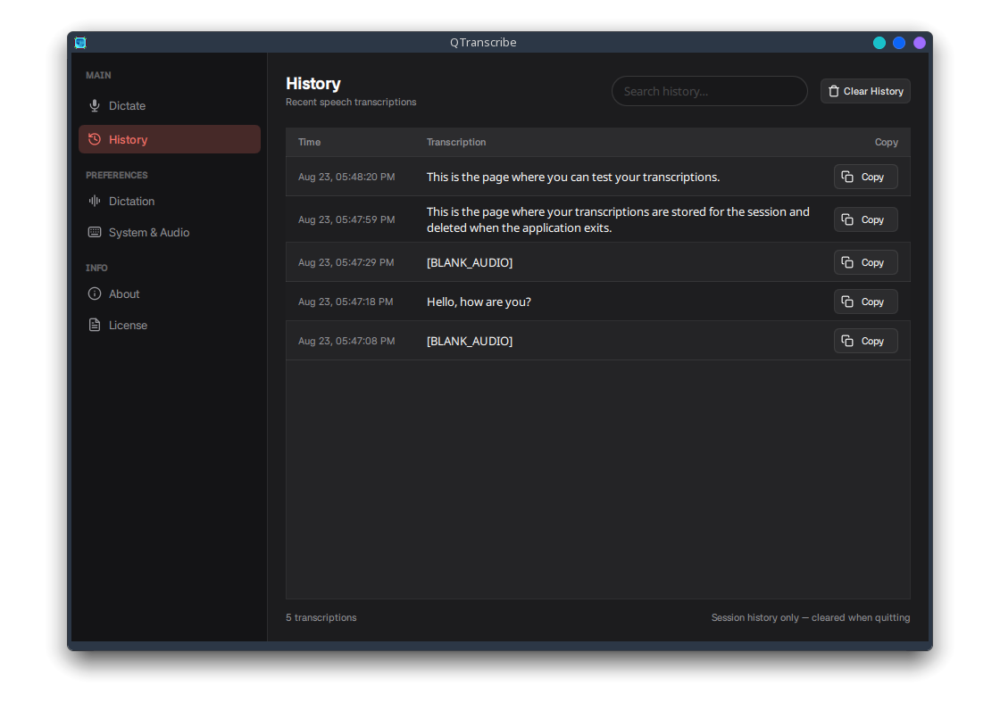

# QTranscribe

Speech-to-text for Wayland. Press a shortcut, speak, and your dictation is typed directly into the active focused input field.

Uses offline `whisper.cpp` by default with Vulkan GPU acceleration or CPU fallback, with optional cloud transcription via the Groq Whisper API. Built natively with Qt 6 and QML for Wayland.

<p align="center">
  
</p>

---

## Screenshots

<p align="center">
  
  
</p>
<p align="center">
  
  
</p>
<p align="center">
  
  
</p>
<p align="center">
  
  
</p>
<p align="center">
  
</p>

---

## Features

- **Direct typing into focused fields.** Inserts transcribed text directly into the active input field across browsers, editors, and chat apps without touching the clipboard.
- **Push-to-talk and toggle modes.** Hold to record and release to transcribe on supported desktop environments, or use toggle shortcuts.
- **Offline by default.** Transcribes speech on-device using `whisper.cpp` without sending audio over the network.
- **Hardware accelerated.** Runs local models on Vulkan-supported GPUs with automatic CPU fallback.
- **Fast cloud transcription.** Optional Groq Whisper API integration for fast cloud dictation. Free Groq API keys are available at [console.groq.com](https://console.groq.com/keys).
- **Text enhancement.** Clean up spoken drafts, fix grammar, format notes into bullet points, or apply custom prompts using Groq language models.
- **Language support.** Automatic language detection or manual selection across all supported Whisper languages.
- **Custom vocabulary.** Supply specialized terms, acronyms, or names to improve recognition accuracy.
- **Global shortcuts and tray.** Control recording with global keyboard shortcuts, system tray controls, or CLI commands.
- **Audio cues.** Plays audio chimes when recording starts and finishes.
- **Secure key storage.** Stores cloud API keys in the system keyring (KWallet, GNOME Keyring, or Secret Service).
- **History and usage.** Browse past dictations, copy previous snippets, and view Groq API quota usage.

---

## Installation

Pre-built packages are attached to each [GitHub release](../../releases).

### Debian and Ubuntu (`.deb`)

```bash
sudo apt install ./qtranscribe_*_amd64.deb
```

Installs binaries to `/usr/bin/qtranscribe` and `/usr/bin/keyinjectord`, installs desktop files, and configures file capabilities on the helper daemon.

To uninstall:
```bash
sudo apt remove qtranscribe
```

### Fedora and RHEL (`.rpm`)

```bash
sudo dnf install ./qtranscribe-*.x86_64.rpm
```

To uninstall:
```bash
sudo dnf remove qtranscribe
```

### Arch Linux (`.pkg.tar.zst` / AUR)

```bash
# Pre-built package
sudo pacman -U ./qtranscribe-*-x86_64.pkg.tar.zst

# AUR
yay -S qtranscribe
```

To uninstall:
```bash
sudo pacman -R qtranscribe
```

---

## Desktop environment support and Wayland notes

For the best experience, use GNOME 48 or above, or KDE Plasma 6 and above. These environments support the global shortcuts portal natively, enabling push-to-talk dictation out of the box without manual keybind setup.

### Input injection and security

QTranscribe has no ability to read, intercept, or log keystrokes. It only has write access to inject transcribed text through a helper daemon writing to `/dev/uinput`.

### Push-to-talk portal support

Push-to-talk mode requires the desktop compositor to implement the `org.freedesktop.portal.GlobalShortcuts` portal interface. The portal delivers press and release events, allowing the app to detect when a key is held down and released. On environments without this portal, dictation works via toggle mode using a custom shortcut mapped to `qtranscribe --toggle`.

| Desktop environment | Status | Push-to-talk | Notes |
| :--- | :---: | :---: | :--- |
| **KDE Plasma 6** | Supported | Supported | Native KWallet integration, system Qt theming, and Klipper privacy flags |
| **GNOME 48+** | Supported | Supported | Uses GNOME Keyring and Secret Service |
| **GNOME 46** | Supported | Unsupported | Toggle mode only. Map a custom shortcut to `qtranscribe --toggle` in Settings |
| **COSMIC** (System76) | Supported | Unsupported | Toggle mode only. Map a custom shortcut to `qtranscribe --toggle` in Settings |
| **Hyprland** | Supported | Unsupported | Toggle mode only. Bind `qtranscribe --toggle` in `hyprland.conf` |
| **Sway / wlroots** | Supported | Unsupported | Toggle mode only. Bind `qtranscribe --toggle` in your compositor configuration |

---

## CLI options

The `qtranscribe` binary supports command-line actions for scripting and window manager bindings:

| Option | Short | Description |
| :--- | :---: | :--- |
| `--toggle` | `-t` | Toggle recording state |
| `--start` | | Start recording |
| `--stop` | | Stop recording and transcribe |
| `--show` | `-s` | Focus and display the main window |
| `--quit` | `-q` | Terminate running instance |
| `--help` | `-h` | Print help message |
| `--version` | `-v` | Print application version |

---

## Usage

### 1. Engine configuration
Launch QTranscribe and open **Settings**:
- **Offline (default):** Download a model (such as `tiny.en` or `base.en`) in **Offline Dictation**.
- **Cloud (Groq):** Get a free API key at [console.groq.com](https://console.groq.com/keys) and paste it under **Cloud & API**. Keys are saved to the system keyring, which prompts for your password to unlock the wallet when needed.

### 2. Set shortcut
- **Plasma 6, GNOME 48+:** Approve the portal shortcut prompt on first start. Supports both toggle and push-to-talk.
- **COSMIC, GNOME 46, Hyprland, Sway:** Bind a custom keyboard shortcut to `qtranscribe --toggle` in your desktop or compositor settings.

### 3. Dictate
- **Push-to-talk (Portal DEs):** Focus any input field, hold your shortcut, speak, and release.
- **Toggle mode:** Focus any input field, hit your shortcut, speak, and press it again to finish.

---

## Tips

- **Mouse bindings.** Bind `qtranscribe --toggle` to an extra mouse button using `input-remapper` or Piper for toggle dictation.
- **Pre-injection delay.** If an application drops the first keystroke after switching focus, increase the delay slider in **System & Typing**.

---

## Troubleshooting

- **No text typed into target field:**
  - Verify the destination input field has active keyboard focus.
  - If using a local development build, ensure capabilities were granted: `sudo setcap cap_dac_override+ep build/keyinjectord`.
  - Run `qtranscribe` in your terminal to view debug logs.
- **Push-to-talk does not work:**
  - Push-to-talk requires a desktop environment with `org.freedesktop.portal.GlobalShortcuts` (KDE Plasma 6, GNOME 48+). On GNOME 46, COSMIC, Hyprland, or Sway, use toggle mode with `qtranscribe --toggle`.
- **Global shortcut does not fire on GNOME 46, Hyprland, or Sway:**
  - The desktop portal shortcut interface is not supported on these compositors. Add a native desktop shortcut that executes `qtranscribe --toggle`.
- **Local model fails to load:**
  - Verify that the model download completed under `~/.local/share/qtranscribe/models/`.
  - Check log output for Vulkan driver errors. If your GPU driver lacks compute support, inference falls back to CPU threads automatically.
- **Groq API errors:**
  - Check your API key and network connection. Free tier keys are subject to Groq rate limits.
- **Prompted for password on startup:**
  - This is expected. Your system asks for your password to unlock the wallet or keyring (GNOME Keyring or KWallet) so QTranscribe can read stored API keys.
- **Keyring unlocked warning or errors:**
  - Ensure `gnome-keyring-daemon` or `kwalletd` is running and unlocked for your user session.
- **Clipboard contents overwritten:**
  - If `keyinjectord` cannot access `/dev/uinput`, QTranscribe falls back to clipboard paste. Non-text data (such as image clips) cannot be restored after pasting. Ensure `keyinjectord` has proper capabilities set.

---

## Roadmap

- [x] **Encrypted file fallback for API keys.** Fallback storage mechanism when system keyring / Secret Service is unavailable.
- [x] **Push-to-talk mode.** Hold shortcut to record, release to transcribe and type on supported desktop environments.
- [ ] **Improved clipboard restoration.** Better handling for non-KDE environments that lack integrated clipboard managers.
- [ ] **Audio file transcription.** Upload and transcribe local audio recordings directly from the UI or CLI.
- [ ] **First-run onboarding.** Setup assistant to guide new users through permissions, microphone selection, and shortcut configuration.
- [ ] **Native wlroots input protocols.** Support for protocols like `virtual-keyboard-v1` on wlroots compositors (Sway, River, Hyprland).
- [ ] **Simplified settings UI.** Streamlined preferences layout with basic and advanced view modes.
- [ ] **More cloud providers.** Additional backends such as OpenAI Whisper and Deepgram.
- [ ] **Backup and restore.** Export and import application settings, custom vocabulary, prompts, and dictation history.
- [ ] **Voice macros.** Trigger desktop actions and simulate keyboard shortcuts based on spoken voice commands.
- [ ] **Floating dictation overlay.** Minimal on-screen indicator near the active input cursor during recording.

---

## Building from source

### Prerequisites

#### Core build dependencies
- **CMake:** Version 3.25 or newer
- **Ninja:** Build tool
- **C++20 compiler:** GCC 13+ or Clang 17+
- **pkg-config** / **pkgconf**

#### Qt 6 libraries and modules
- **Qt 6:** Version 6.11 or newer (`qtbase`, `qtdeclarative`, `qtmultimedia`, `qtwayland`, `qtquickcontrols2`, `qtquickeffects`, `qtdbus`)
- **Qt6Keychain:** Version 0.15.0 or newer (built against Qt 6)

#### System libraries and protocols
- **libevdev:** Development headers (`libevdev-dev` / `libevdev-devel`)
- **libcap:** Development headers and utilities (`libcap-dev` / `libcap-devel`, `libcap2-bin`)
- **libsecret:** Secret Service development library (`libsecret-1-dev` / `libsecret-devel`)
- **Wayland:** Client libraries and protocols (`libwayland-dev`, `wayland-protocols`, `libxkbcommon-dev`)

#### Hardware acceleration (optional)
- **Vulkan SDK:** `libvulkan-dev` / `vulkan-headers`
- **Shader compiler:** `glslc` (from `shaderc`)
- **SPIR-V:** `spirv-headers`

#### Code formatting and linting (optional)
- **clang-format:** LLVM 17+
- **qmllint** and **qmlformat:** Included with Qt 6
- **pre-commit:** For Git hygiene hooks

### 1. Build application and daemon

```bash
# Configure and build in debug mode
cmake --preset linux-qt6-debug
cmake --build build

# Or build only the GUI application
cmake --build build --target qtranscribe
```

### 2. Grant helper daemon capability

```bash
sudo setcap cap_dac_override+ep build/keyinjectord
```

### 3. Run tests and linting

```bash
# Run unit and QML lint tests
ctest --preset test-debug

# Format all C++ and QML source files
cmake --build build --target format

# Run QML linter
cmake --build build --target all_qmllint

# Run full pre-commit test suite
pre-commit run --all-files
```

### 4. Release build

```bash
cmake --preset linux-qt6-release
cmake --build build-release
ctest --preset test-release
```

---

## Packaging

Docker build scripts live in [`packaging/`](packaging/):

<details>
<summary><strong>Debian and Ubuntu (.deb)</strong></summary>

```bash
./packaging/deb/build-deb.sh 24.04 1.2.0
sudo apt install ./dist/deb/qtranscribe_1.2.0_amd64.deb
```
</details>

<details>
<summary><strong>Fedora and RHEL RPM (.rpm)</strong></summary>

```bash
./packaging/rpm/build-rpm.sh 44 1.2.0 1
sudo dnf install ./dist/rpm/qtranscribe-1.2.0-1.fc44.x86_64.rpm
```
</details>

<details>
<summary><strong>Arch Linux (.pkg.tar.zst)</strong></summary>

```bash
./packaging/arch/build-arch.sh 1.2.0 1
sudo pacman -U ./dist/arch/qtranscribe-1.2.0-1-x86_64.pkg.tar.zst
```
</details>
